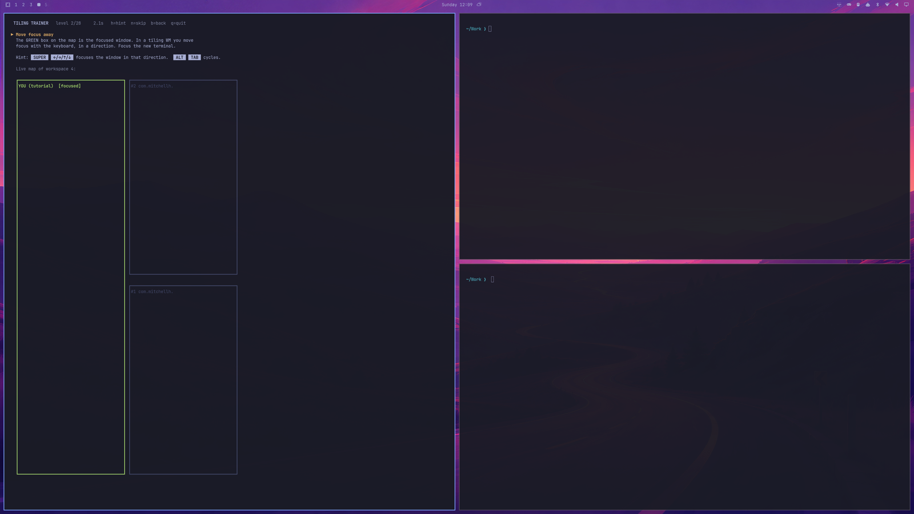
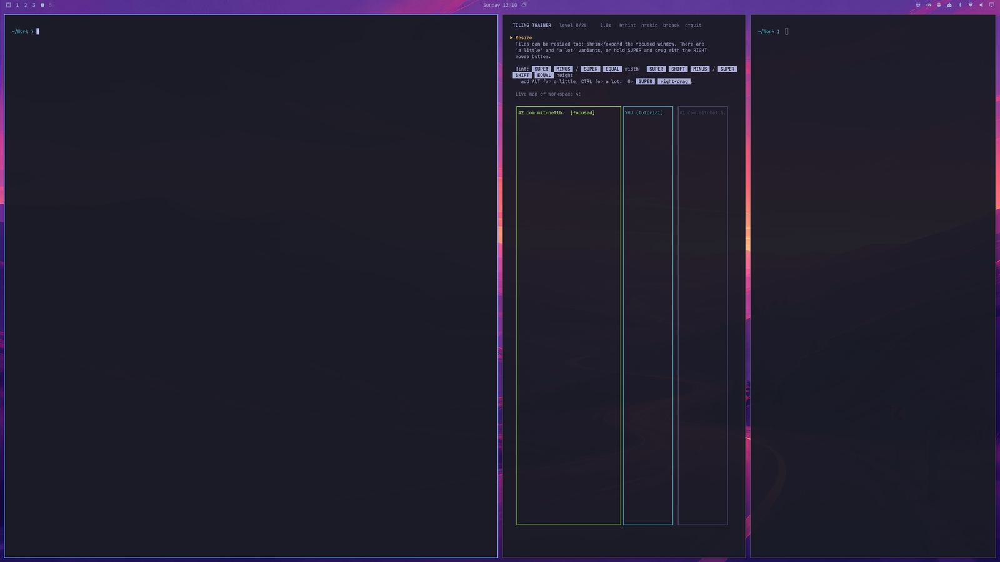
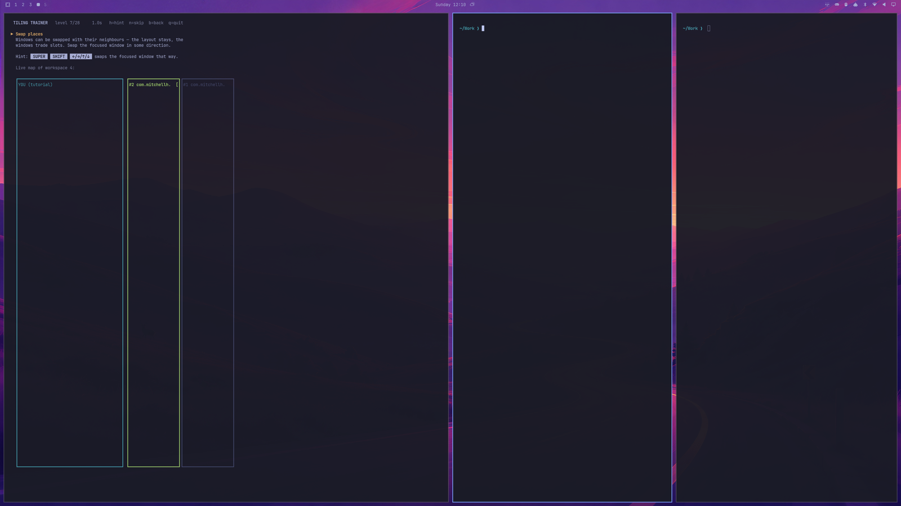
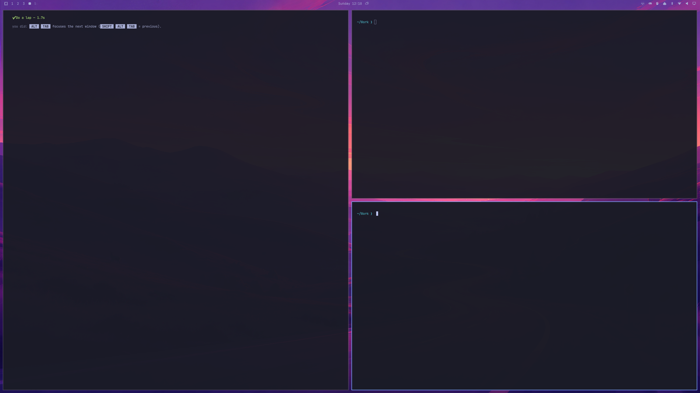
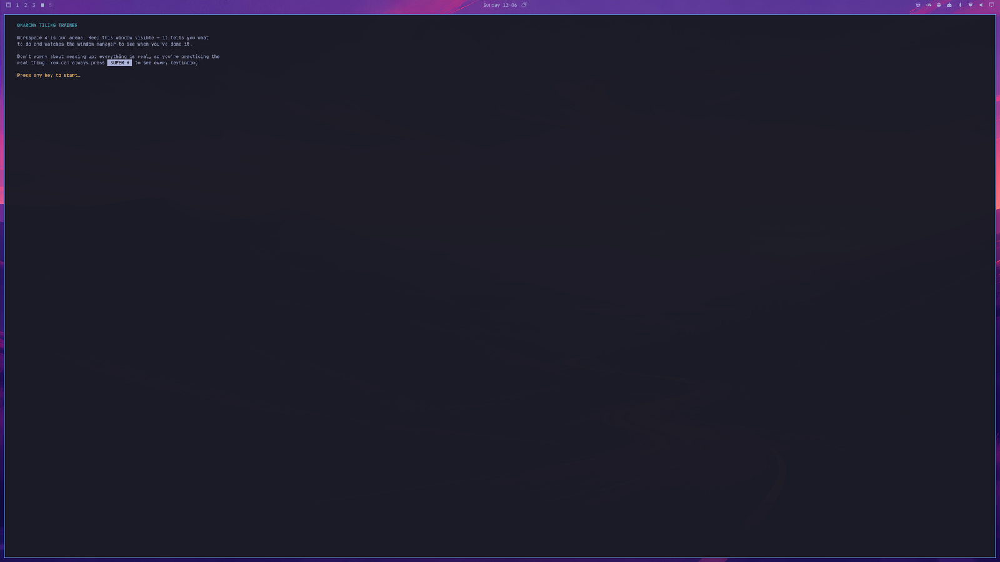

# Tiling Trainer for Omarchy

Learn Omarchy / Hyprland window management **by playing**.

Tiling Trainer is a terminal game that watches the *real* window manager
(via `hyprctl`) and ticks off each mission the moment you actually perform it
with the real keys. A live ASCII mini-map shows your tiles splitting, swapping,
floating and fullscreening as you press them.

Missions: open terminals · move focus · alt-tab lap · flip the split · swap · resize ·
save & restore width · pseudo · fullscreen · float · window groups (tabs) ·
scrolling layout · workspaces · former-workspace boomerang · multi-monitor
(if you have one) · move windows between workspaces · scratchpad · gaps
toggle · close. Then a timed **boss round** with the hints hidden.

## Install (as an Omarchy shell plugin)

    omarchy plugin add https://github.com/sponno/omarchy-tiling-trainer.git --enable

A 󰊗 icon appears in your bar — click it to play. Remove with
`omarchy plugin remove io.github.sponno.tiling-trainer`.

## Or just run the script

No plugin needed — it's a single dependency-free Python file. The URL is
pinned to the v1.1.0 release commit, so the script you run is exactly the
code that was reviewed:

    curl -fsSL https://raw.githubusercontent.com/sponno/omarchy-tiling-trainer/dcc8f285025de24c3f6321a43231af7f8ae8bf22/tiling-game.py -o /tmp/tiling-game.py
    omarchy launch terminal python3 /tmp/tiling-game.py

## Screenshots

The map is drawn from live `hyprctl` state, so it always matches what the
window manager is really doing — here the swap mission has just moved the
game's own window into the middle column:

## In-game keys

`h` hint on/off · `n` skip level · `b` back a level · `q` quit.
Cheat sheet any time in Omarchy: **SUPER + K**.

## How it works

Every ~100 ms the game reads `hyprctl -j clients / monitors / activewindow`,
compares the state against the current mission (window count, focus, position,
size, floating/fullscreen flags, workspace ids) and advances when it matches.
It moves itself to an empty workspace at start so it has a clean arena, and it
finds its own window by walking its parent PIDs. The plugin's `BarWidget.qml`
is only a launcher; everything lives in `tiling-game.py`.

## License

MIT — see LICENSE.
